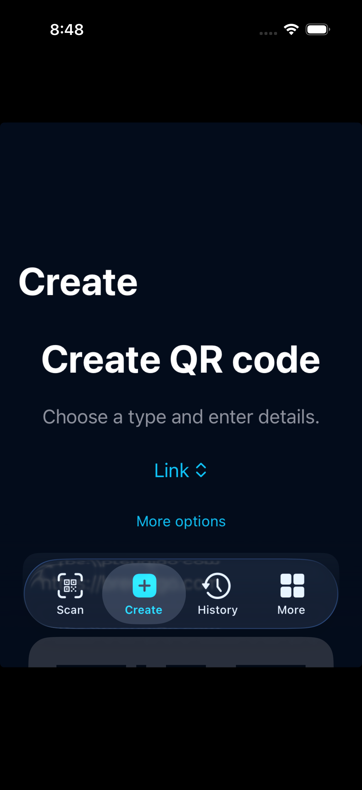

<div align="center">


### Scan. Create. Share.

**A fast, private QR scanner and creator for Android and iOS.** No account. No ads. No unnecessary steps.

[](https://github.com/bren-wp/Qivio/actions/workflows/mobile.yml)
[](https://github.com/bren-wp/Qivio/actions/workflows/native-platforms.yml)
[](https://github.com/bren-wp/Qivio/releases/latest)


**[Download Android](https://github.com/bren-wp/Qivio/releases/latest)** · **[Features](#everything-qr-without-the-clutter)** · **[Source code](#build-and-development)**

</div>

## Everything QR. Without the clutter.

Scan a QR code, preview its contents, then choose exactly what happens next. Create your own QR codes, scan photos, copy or share results, and keep an optional local history. Internet access is not required for scanning or generating QR codes.

| Scan | Create | History | More |
|:---:|:---:|:---:|:---:|
| 📷 Camera & photos | ✨ QR code types | 🕘 Search & save | ⚙️ Preferences & privacy |

### Actual application screenshots

Only verified **runtime screenshots of the application** are shown below. The iOS image was captured from a running iPhone simulator; the Android image is withheld until its emulator capture passes. These are not generated marketing mockups. [Screenshot verification workflow](https://github.com/bren-wp/Qivio/actions/workflows/capture-screenshots.yml).

<table>
<tr><th>iOS · Create (verified simulator capture)</th><th>Android · Create (capture pending)</th></tr>
<tr>
<td align="center"></td>
<td align="center">The Android screen will be displayed here after a real emulator capture passes image validation. <a href="https://github.com/bren-wp/Qivio/actions/workflows/capture-screenshots.yml">View screenshot QA</a>.</td>
</tr>
</table>

These are test-device captures, not claims of pixel-perfect parity with every reference design or physical device. The full visual QA and store submission are separate release gates.

## What QREX can do

- **Scan securely:** locally detect QR codes using the camera or an image selected from your gallery. Preview URL destinations before choosing to open them.
- **Create QR codes:** URLs, text, Wi-Fi, email, phone, location, and contact information. The latest public Flutter release also supports event codes; feature parity in the Kotlin/Swift projects is still being completed.
- **Save and find:** optional scan history, saved codes, local search, and the ability to erase your data.
- **Share deliberately:** use system sharing and clipboard only when you tap an action.
- **Personalize:** choose a light or dark interface and a preferred language.

## 23 languages, English by default

QREX is designed with **English as the primary language**. Open **More → Settings → Language** to switch without an account or internet connection.

English · Croatian · German · French · Spanish · Italian · Portuguese · Dutch · Polish · Czech · Slovak · Slovenian · Hungarian · Romanian · Bulgarian · Greek · Turkish · Ukrainian · Russian · Swedish · Danish · Finnish · Norwegian Bokmål.

The single [translation catalog](l10n/catalog.json) contains **67 complete message keys for each of 23 languages**. Android and iOS resource files are generated from it and verified in CI. Contributions to terminology and language quality are welcome; language coverage and device QA are distinct checks.

## Branding

<div align="center">
<table>
<tr>
<td align="center"><br><strong>App icon</strong></td>
<td align="center"><br><strong>Brand wordmark</strong></td>
</tr>
</table>
</div>

| Color | Hex | Usage |
|---|---|---|
| Midnight navy | `#030C1B` | Background |
| Electric blue | `#1677FF` | Primary action |
| Cyan | `#10C5FA` | Scanner highlight |
| Purple | `#9047F8` | Gradients |
| Surface blue | `#101B2C` | Cards |

## Privacy by design

**No sign-in. No ads. No analytics. No account backend.**

QR detection and generation are performed on the device. Wi-Fi QR values are not added to scan history automatically. Manually saved Wi-Fi codes may contain passwords; the local settings storage is **not an encrypted password vault**. External links and system sharing may transfer data to external services only when the user chooses them.

Read the [privacy policy](docs/PRIVACY.md) and the [store submission checklist](docs/STORE_CHECKLIST.md). The QREX Settings page includes a **Developed by Brendigo** attribution linking to [brendigo.com](https://brendigo.com).

## Downloads and current release status

The latest **published** release is **v0.1.3**, currently built from the earlier Flutter codebase. Its APK is available from [GitHub Releases](https://github.com/bren-wp/Qivio/releases/latest), along with a SHA-256 checksum. The newer Kotlin and Swift applications are being refined and tested; new translated builds should not be considered publicly released until a verified release exists.

An App Store-installable iOS build requires Apple Developer signing and provisioning. A Play Store build needs a production upload signing key, metadata, privacy disclosures and device QA.

## Build and development

QREX contains two platform-focused applications:

| Android | iOS |
|---|---|
| Kotlin + Jetpack Compose | Swift + SwiftUI |
| CameraX + on-device ML Kit | AVFoundation + Vision |
| ZXing QR creation | Core Image QR creation |
| Android Studio / Gradle | Xcode / XcodeGen |

Android:

```bash
cd platforms/android
gradle :app:assembleDebug :app:testDebugUnitTest
```

iOS (macOS):

```bash
cd platforms/ios
xcodegen generate --spec project.yml
xcodebuild -project QREX.xcodeproj -scheme QREX -configuration Release \
  -sdk iphonesimulator -destination "generic/platform=iOS Simulator" \
  CODE_SIGNING_ALLOWED=NO build
```

Regenerate or check all localized Android/iOS resources:

```bash
python3 tool/generate_localizations.py
python3 tool/generate_localizations.py --check
```

The previous Flutter implementation remains in `lib/` until the standalone projects match its features and can migrate stored data safely.

**Development documentation:** [Platform projects](platforms/README.md) · [Localization source](l10n/catalog.json) · [Privacy policy](docs/PRIVACY.md) · [Security audit](docs/audits/2026-10-09-qrex.md) · [Release notes](RELEASE_NOTES.md) · [CI](https://github.com/bren-wp/Qivio/actions)

---

<div align="center">

**QREX · Scan. Create. Share.**

Developed by [Brendigo](https://brendigo.com) · [MIT License](LICENSE) · [Report an issue](https://github.com/bren-wp/Qivio/issues)

</div>
