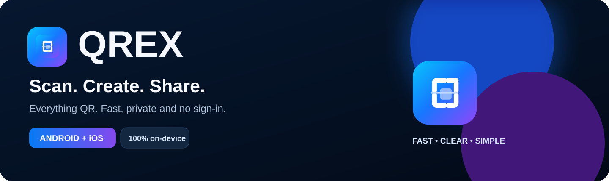
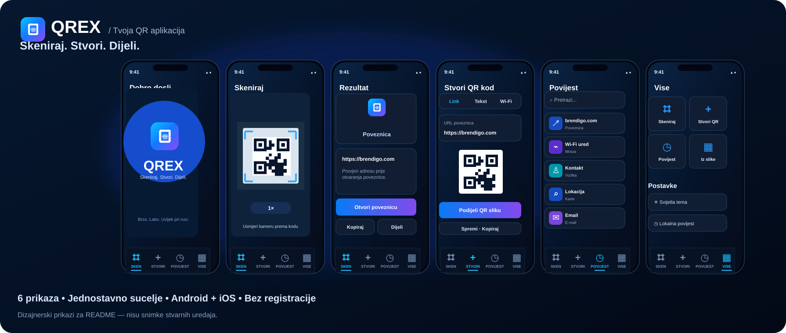
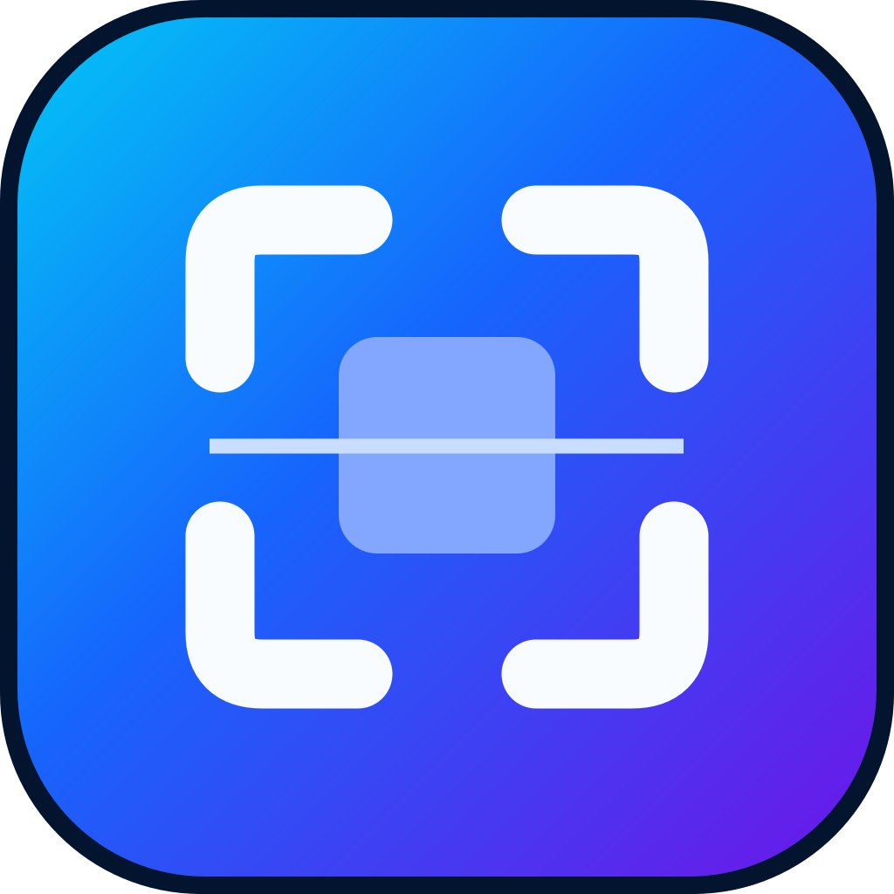

<div align="center">


### Skeniraj. Stvori. Dijeli.

**Jednostavna i brza QR aplikacija za Android i iOS.** Bez prijave, reklama i nepotrebnih koraka.

[](https://github.com/bren-wp/Qivio/actions/workflows/mobile.yml)
[](https://github.com/bren-wp/Qivio/releases)




**[⬇️ Preuzmi Android APK](https://github.com/bren-wp/Qivio/releases/latest)** · **[📱 Pogledaj dizajn](#dizajn-i-ekrani)** · **[💻 Kod i izgradnja](#razvoj-i-izgradnja)**

</div>

## Sve što QR može. Bez kompliciranja.

QREX je mobilni skener i kreator QR kodova napravljen da *radi odmah*. Otvori aplikaciju, usmjeri kameru, pregledaj rezultat i odaberi radnju. Ne treba ti račun, pretplata ni internetska veza za skeniranje i izradu QR kodova.

<table><tr><td align="center" width="25%"><b>📷 SKENIRAJ</b><br><sub>Kamera i fotografije</sub></td><td align="center" width="25%"><b>✨ STVORI</b><br><sub>8 vrsta QR sadržaja</sub></td><td align="center" width="25%"><b>🕓 POVIJEST</b><br><sub>Pronađi i spremi</sub></td><td align="center" width="25%"><b>⚙️ VIŠE</b><br><sub>Postavke i privatnost</sub></td></tr></table>

## Dizajn i ekrani



*Dizajnerski prikazi izrađeni prema dostavljenom QREX vizualnom predlošku. To su ilustracije, a ne automatske snimke s fizičkih Android ili iOS uređaja; raspored se prilagođava veličini zaslona.*

### Osmišljen za jedan dodir

- **Pametno skeniranje:** kamera, fotografija iz galerije, svjetiljka i zumiranje gdje je podržano.
- **Jasan rezultat:** puna adresa ili sadržaj prije radnje — bez automatskog otvaranja web poveznica.
- **QR kreator:** URL, običan tekst, Wi-Fi, kontakt, e-mail, telefon, geolokacija ili kalendarski događaj.
- **Sve na uređaju:** lokalna povijest, označavanje spremljenih kodova, pretraživanje i brisanje podataka.
- **Brzo dijeljenje:** kopiraj sadržaj, podijeli rezultat ili pošalji sliku stvorenog QR koda.
- **Dva izgleda:** premium tamni prikaz s električno plavim i ljubičastim akcentima ili svijetla tema.

## Ikonica i vizualni identitet

<div align="center">
<table><tr>
<td align="center"><br><b>QREX ikonica</b></td>
<td align="center"><br><b>QREX logotip</b></td>
</tr></table>
</div>

| Boja | HEX | Namjena |
| --- | --- | --- |
| Ponoćno plava | `#030C1B` | Pozadina |
| Električno plava | `#1677FF` | Primarne akcije |
| Cijan | `#10C5FA` | Skeniranje i naglasci |
| Ljubičasta | `#9047F8` | Gradijenti i detalji |
| Plava površina | `#101B2C` | Kartice i navigacija |

## Privatnost dolazi prije svega

**[Pravila privatnosti](docs/PRIVACY.md)** dostupna su i unutar aplikacije, bez internetske veze. U izborniku **Više → O aplikaciji** prikazana je oznaka **Razvio Brendigo** s poveznicom na [brendigo.com](https://brendigo.com).

**[Kontrolni popis za Google Play i App Store](docs/STORE_CHECKLIST.md)** prikazuje što je ugrađeno i koje obavezne korake još treba odraditi prije službene distribucije.


**Bez korisničkog računa · Bez analitičkog praćenja · Bez oglasa · Bez vlastitog backenda.**

Skeniranje i generiranje izvode se na uređaju. Povijest je lokalna, opcionalna i može se izbrisati u postavkama. Vanjske stranice, pozivi, e-mail, dijeljenje i navigacija mogu koristiti druge aplikacije ili internetsku vezu. QREX ne potvrđuje sigurnost vanjskih URL-ova — zato ih prikazuje prije otvaranja.

## Instalacija

### Android
Otvori **[Releases](https://github.com/bren-wp/Qivio/releases/latest)** i preuzmi **QREX-Android-0.1.3.apk**. GitHub izdanje uključuje i SHA-256 kontrolni zbroj. APK je početna testna izgradnja, ne Google Play distribucija.

### iOS
Za iOS se u GitHub Actions automatski gradi nepotpisana aplikacija. Instalacijski IPA i objava na App Storeu zahtijevaju Apple certifikat, provisioning profile i završne provjere.

## Razvoj i izgradnja

Zajednički Flutter projekt koristi iste komponente i poslovnu logiku za Android i iOS.

```bash
flutter create --platforms=android,ios --org com.brendigo --project-name qrex .
python3 tool/prepare_platforms.py
flutter pub get
flutter analyze
flutter test
flutter run
```

Za Android: `flutter build apk --release` ili `flutter build appbundle --release`; za iOS na macOS-u: `flutter build ios --release --no-codesign`. Platformski direktoriji generiraju se iz odgovarajućeg Flutter predloška pa se ne pohranjuju u ovom repozitoriju. Skripta `tool/prepare_platforms.py` dodaje potrebne dozvole, nazive aplikacije i ikonice.

GitHub CI: **[Mobile CI](https://github.com/bren-wp/Qivio/actions/workflows/mobile.yml)**. Prvo izdanje objavljuje se tek kad Android i iOS provjere prođu.

### Dokumentacija

- [📄 Bilješke izdanja](RELEASE_NOTES.md)
- [🔐 Pravila privatnosti](docs/PRIVACY.md)
- [✅ Google Play / App Store zahtjevi](docs/STORE_CHECKLIST.md)
- [🎨 QREX logotip](assets/brand/qrex-logo.svg)
- [📦 App ikonica](assets/brand/qrex-icon.svg)
- [🖼️ Ekrani aplikacije](assets/previews/qrex-showcase.svg)

---

<div align="center">

**QREX — Skeniraj. Stvori. Dijeli.**

Izradio [Brendigo](https://brendigo.com) · [MIT licencija](LICENSE) · [Prijavi problem](https://github.com/bren-wp/Qivio/issues)

</div>
